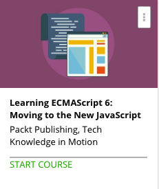

```
Roberto Nogueira  
BSd EE, MSd CE
Solution Integrator Experienced - Certified by Ericsson
```
# Udemy project



**About**

Take your first steps into the new world of `ECMAScript` to effortlessly code in an asynchronous environment.

[Homepage](https://www.udemy.com/learning-ecmascript-6-moving-to-the-new-javascript/)

## Topics
```
Section: 1
0 / 4
Setting Up Your Environment
[x] 1. The Course Overview 5:43
[x] 2. Installing Tools 3:34
[x] 3. Basic Transpiling 3:43
[x] 4. Browser Support 4:04

Section: 2
0 / 3
ES6 Basics
[x] 5. Setting Up a Sample Application 4:07
[ ] 6. let Versus var Versus const 3:11
[ ] 7. Using an Arrow 4:13

Section: 3
0 / 3
Classes and Modules
[ ] 8. Classes Versus Prototypes 3:48
[ ] 9. Modules 3:43
[ ] 10. Inheritance 4:29

Section: 4
0 / 3
More Advanced Features
[ ] 11. Collection Types 4:50
[ ] 12. Destructuring Assignment 3:01
[ ] 13. Template Literals and Symbols 3:10

Section: 5
0 / 3
Iterators and Generators
[ ] 14. Generator Functions 4:37
[ ] 15. Iterators 3:13
[ ] 16. Coroutines 3:18

Section: 6
0 / 3
Promises
[ ] 17. Reading a File 4:32
[ ] 18. Parallel Processing 3:20
[ ] 19. Promises by core.js 3:45

Section: 7
0 / 3
ES Experimental
[ ] 20. ES Proposals Flow 4:00
[ ] 21. Some Experimental Examples 4:27
[ ] 22. Async Await in Practice 5:09

Section: 8
0 / 2
References and Tooling
[ ] 23. Type Checking JavaScript 5:18
[ ] 24. ES6 Overview and References 7:37
```
